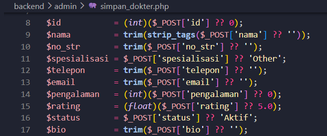
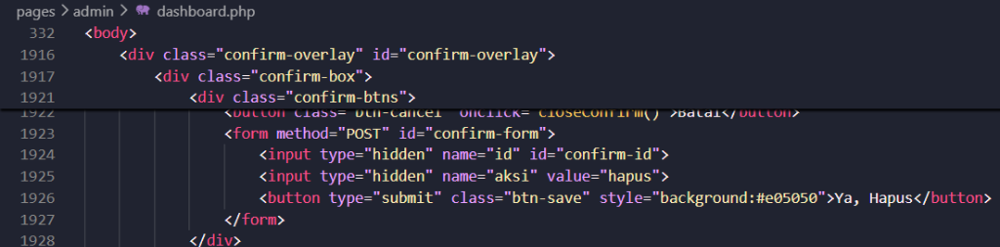
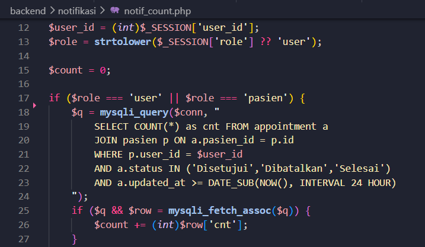
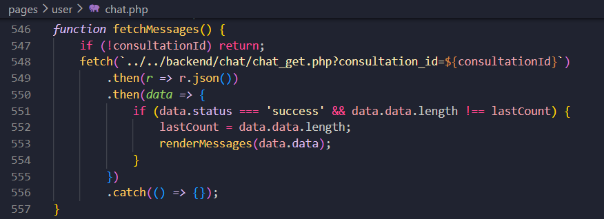
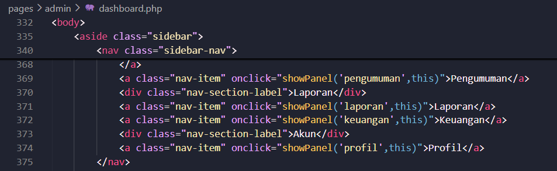
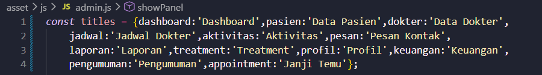

# GlowCare Clinic

Sistem Informasi Manajemen Klinik Kecantikan Berbasis Web

## Deskripsi
GlowCare Clinic adalah sebuah sistem informasi berbasis website yang dirancang untuk mengelola seluruh aktivitas operasional klinik kecantikan secara digital. Sistem ini memungkinkan pasien untuk melakukan pendaftaran konsultasi secara online, memilih jadwal dokter, serta melihat informasi treatment yang ditawarkan. Dokter dapat mengelola jadwal konsultasi dan mengisi hasil pemeriksaan pasien secara langsung ke dalam sistem. Di sisi lain, pihak admin memiliki kontrol penuh untuk mengelola data pasien, dokter, treatment, jadwal, keuangan kasir, laporan bulanan, serta pengumuman instan.

# Team & Roles
| Nama Anggota | Role | Tanggung Jawab |
|---|---|---|
| I Gde Surya Laksana | Backend Developer | Pembuatan dan pengelolaan database MySQL, query CRUD (pasien, dokter, appointment, treatment), serta logika server-side menggunakan PHP |
| Nurhidayah Maulidia | Frontend Developer | Mendesain tampilan antarmuka pengguna, mengembangkan form interaktif, dan menyusun layout Landing Page menggunakan HTML, CSS, dan JavaScript |
| Ni Komang Ayu Sumeitri | Full Integration & Frontend Developer | Menghubungkan frontend dengan backend (PHP–MySQL) serta mengembangkan halaman treatment, detail treatment, dan dashboard utama untuk pasien, dokter, dan admin |

# Menu / Sitemap
```text
GlowCare Clinic
│
├── PENGGUNA PUBLIK (TAMU / PENGUNJUNG)
│   ├── Landing Page (index.php)
│   ├── Tentang Kami (pages/about.php)
│   ├── Dokter Spesialis (pages/spesialis.php)
│   ├── Hubungi Kami (pages/kontak.php)
│   └── Katalog Treatment (pages/treatment/treatment.php)
│       └── Detail & Info Treatment (pages/treatment/detail_treatment.php)
│
├── AUTENTIKASI PENGGUNA
│   ├── Masuk Akun / Sign In (pages/auth/Signin.php)
│   └── Daftar Akun Pasien / Sign Up (pages/auth/SignUp.php)
│
├── PORTAL PASIEN (PASIEN)
│   ├── Dashboard Pasien (pages/user/dashboarduser.php)
│   │   ├── Beranda Status Janji Temu Aktif
│   │   ├── Jadwal Dokter Real-Time
│   │   ├── Form Booking Konsultasi & Pilih Jadwal
│   │   ├── Riwayat Perawatan & Rekam Medis Detail
│   │   └── Kelola Profil Akun
│   └── Konsultasi Chat (pages/user/chat.php)
│       └── Obrolan Interaktif dengan Dokter Terkait
│
├── PORTAL DOKTER (DOKTER)
│   ├── Dashboard Dokter (pages/dokter/dashboardDokter.php)
│   │   ├── Ringkasan Statistik Bulanan
│   │   ├── Kalender Jadwal Praktik Mingguan
│   │   ├── Daftar Antrean Pasien Terjadwal
│   │   ├── Rekam Medis (Input & Edit Catatan Medis)
│   │   ├── Ulasan & Bintang dari Pasien
│   │   └── Kelola Profil Dokter & Ganti Password
│   └── Konsultasi Chat (pages/dokter/chat.php)
│       └── Obrolan Interaktif dengan Pasien
│
└── ADMIN (SUPER ADMIN)
    └── Dashboard Admin (pages/admin/dashboard.php)
        ├── Ringkasan Statistik & Grafik Pendapatan
        ├── Kelola Data Pasien (CRUD)
        ├── Kelola Data Dokter & Kehadiran (CRUD)
        ├── Atur Jadwal Praktik Harian Dokter (CRUD)
        ├── Manajemen Janji Temu & Konfirmasi Booking
        ├── Kelola Katalog Tindakan Treatment (CRUD)
        ├── Daftar Pesan Kontak (Baca, Hapus, & Balas via Email)
        ├── Kirim Broadcast Pengumuman Instan
        ├── Laporan Rekap & Download CSV/PDF
        └── Kelola Catatan Keuangan Kasir & Pengeluaran (CRUD)
```

# Struktur Direktori & File
```text
GlowCare-Clinic/
├── index.php                 # Landing page publik (beranda utama)
├── glowcareclinic.sql        # File backup/dump database MySQL
├── README.md                 # Dokumentasi proyek
│
├── pages/                    # Folder halaman antarmuka pengguna (View)
│   ├── about.php             # Halaman Tentang Kami
│   ├── spesialis.php         # Halaman profil dokter spesialis kecantikan
│   ├── kontak.php            # Halaman Hubungi Kami (form kontak masuk)
│   │
│   ├── auth/                 # Halaman modul autentikasi
│   │   ├── Signin.php        # Form login (pasien, dokter, admin)
│   │   └── SignUp.php        # Form pendaftaran pasien baru
│   │
│   ├── treatment/            # Halaman katalog tindakan kecantikan
│   │   ├── treatment.php     # Katalog seluruh layanan
│   │   └── detail_treatment.php # Informasi detail spesifik treatment
│   │
│   ├── user/                 # Portal interaktif khusus pasien
│   │   ├── dashboarduser.php # Dashboard utama pasien (booking, riwayat, rekam medis)
│   │   └── chat.php          # Halaman konsultasi chat dengan dokter
│   │
│   ├── dokter/               # Portal interaktif khusus dokter
│   │   ├── dashboardDokter.php # Dashboard utama dokter (jadwal praktik, rekam medis)
│   │   └── chat.php          # Halaman konsultasi chat dengan pasien
│   │
│   └── admin/                # Portal interaktif khusus admin
│       └── dashboard.php     # Dashboard Super Admin (manajemen data master, laporan, dll.)
│
├── backend/                  # Berkas logika pemrosesan data (Controller & Model)
│   ├── config/               # Konfigurasi basis data
│   │   └── koneksi.php       # File koneksi database MySQLi
│   │
│   ├── auth/                 # Logika program pendaftaran & masuk sistem
│   │   ├── Regist.php        # Pemrosesan registrasi pasien baru
│   │   ├── log.php           # Pemrosesan login & set session role
│   │   ├── logout.php        # Pengakhiran sesi (logout)
│   │   └── guard_dokter.php  # Pembatasan hak akses dokter
│   │
│   ├── chat/                 # Logika program ruang konsultasi chat
│   │   ├── chat_get.php      # Mengambil pesan obrolan & penandaan sudah dibaca
│   │   └── chat_send.php     # Pengiriman pesan teks & upload gambar
│   │
│   ├── config/               # Berkas konfigurasi basis data
│   │   └── koneksi.php       # File koneksi database MySQL
│   │
│   ├── dokter/               # Logika program portal dokter
│   │   ├── simpan_rekam_medis.php # Menyimpan diagnosis & tindak lanjut rekam medis
│   │   ├── update_profil.php # Perbarui identitas & profil oleh dokter
│   │   └── get_pasien_detail.php # Mengambil info ringkasan medis pasien
│   │
│   ├── kontak/               # Logika penanganan pesan masuk
│   │   └── pesan_kontak.php  # Pengiriman formulir kontak pasien ke database
│   │
│   ├── notifikasi/           # Logika counter pemberitahuan sistem
│   │   └── notif_count.php   # Menghitung notifikasi baru secara dinamis
│   │
│   ├── user/                 # Logika program portal pasien
│   │   ├── simpan_booking.php # Pemrosesan transaksi janji temu baru
│   │   ├── batal_booking.php  # Pembatalan janji temu oleh pasien
│   │   └── simpan_ulasan.php  # Pengiriman feedback & ulasan bintang
│   │
│   ├── admin/                # Logika program portal admin
│   │   ├── simpan_*.php      # Aksi insert/update data (dokter, pasien, treatment, dll.)
│   │   ├── hapus_*.php       # Aksi delete data (dokter, pasien, treatment, dll.)
│   │   ├── kelola_pesan.php  # Proses verifikasi baca & hapus pesan kontak
│   │   └── laporan_download.php # Proses rekap ekspor data format CSV & PDF
│   │
│   └── uploads/              # Direktori penyimpanan media unggahan dinamis
│       ├── dokter/           # File foto profil dokter
│       └── treatment/        # File foto layanan treatment
│
└── asset/                    # Berkas aset statis (frontend global)
    ├── css/                  # File styling (style.css, admin.css, user.css, dokter.css)
    ├── js/                   # File script interaktif (script.js, admin.js, user.js, dokter.js)
    └── img/                  # Folder gambar statis & ikon aset
```

---

# Tech Stack & DBMS Configuration

### Tech Stack

| Kategori | Teknologi |
|---|---|
| **Frontend** | HTML5, CSS3, JavaScript (ES6+), Tailwind CSS (via CDN) |
| **Fonts & Icons** | Google Fonts (Inter, Playfair Display), Material Symbols Outlined |
| **Backend** | Native PHP (PHP Session, Native Routing, MySQLi connection) |
| **Database** | MySQL |
| **Web Server** | Apache (XAMPP / Laragon) |
| **Version Control** | Git & GitHub |
| **Development Tools** | Visual Studio Code, phpMyAdmin, Claude, ChatGPT, Stitch |

### DBMS Configuration

| Parameter | Nilai |
|---|---|
| **DBMS** | MySQL |
| **Nama Database** | `glowcareclinic` |
| **Host** | `localhost` |
| **User** | `root` |
| **Password** | *Kosong (default XAMPP)* |
| **Port** | `3306` |
| **Charset** | `utf8mb4` |
| **Collation** | `utf8mb4_unicode_ci` |

---

# Bug Logs (5 Riwayat Perbaikan Bug)

### Bug Log 1 (Nama Dokter Menampilkan Kode Script)
1) Gejala: Muncul tulisan `<script>console.log('XSS_WORKED')</script>` pada nama dokter di dashboard admin.
2) Langkah reproduksi: Masukkan kode script pada kolom nama dokter, simpan data, lalu buka dashboard admin.
3) Hipotesis penyebab: Sistem menyimpan semua data yang dimasukkan pengguna tanpa memeriksa apakah terdapat kode yang tidak seharusnya disimpan sebagai nama dokter (Stored XSS).
4) Fix (apa yang diubah): Menambahkan pembersihan tag HTML dan Script lewat fungsi `strip_tags()` sebelum nama dokter disimpan pada file `backend/admin/simpan_dokter.php` (baris 9).
5) Bukti (Untuk Screenshot):

   

---

### Bug Log 2 (Gagal Menghapus Pesan Kontak)
1) Gejala: Muncul pesan error "Aksi tidak dikenali" saat admin menghapus pesan kontak.
2) Langkah reproduksi: Admin membuka menu pesan kontak, menekan tombol Hapus, lalu mengonfirmasi penghapusan.
3) Hipotesis penyebab: Sistem tidak menerima informasi bahwa pengguna sedang melakukan proses penghapusan data, sehingga perintah hapus tidak dapat dijalankan (form konfirmasi modal tidak menyertakan parameter `aksi`).
4) Fix (apa yang diubah): Menambahkan input tersembunyi `aksi="hapus"` pada form modal konfirmasi di file `pages/admin/dashboard.php` (baris 1925).
5) Bukti (Untuk Screenshot):

   

---

### Bug Log 3 (Layanan & Dashboard Tidak Dapat Diakses)
1) Gejala: Pasien atau dokter gagal mengakses dashboard dan menu layanan, serta sering kembali ke halaman login.
2) Langkah reproduksi: Login sebagai pasien atau dokter, lalu coba akses dashboard atau halaman layanan.
3) Hipotesis penyebab: Sistem salah mengenali jenis pengguna yang sedang login karena data role yang dibaca tidak sesuai dengan data yang tersimpan di database (masalah pencocokan string role secara case-sensitive).
4) Fix (apa yang diubah): Memperbaiki proses pembacaan role pengguna dengan mengonversinya menjadi huruf kecil menggunakan `strtolower()` dan memperbarui validasi agar mengenali role `'user'` dan `'pasien'` dengan benar pada file `backend/notifikasi/notif_count.php` (baris 13 & 17).
5) Bukti (Untuk Screenshot):

   

---

### Bug Log 4 (Chat Tidak Terkirim ke Dokter & Sebaliknya)
1) Gejala: Pesan chat yang dikirim oleh pasien maupun dokter tidak muncul pada ruang percakapan dan tidak diterima oleh lawan bicara.
2) Langkah reproduksi: Buka halaman chat konsultasi, ketik pesan atau kirim gambar, lalu tekan tombol Kirim.
3) Hipotesis penyebab: Sistem masih mengarah ke lokasi file chat yang lama (`../../backend/chat_send.php`) karena letak file backend chat dipindahkan ke dalam folder `backend/chat/` pasca restrukturisasi.
4) Fix (apa yang diubah): Memperbarui alamat file target fetch pada fitur chat agar mengarah ke lokasi folder backend yang baru pada file `pages/user/chat.php` (baris 548) & `pages/dokter/chat.php` (baris 392).
5) Bukti (Untuk Screenshot):

   

---

### Bug Log 5 (Tombol Sidebar Navigasi Tidak Merespons)
1) Gejala: Beberapa menu sidebar seperti "Pengumuman" tidak menampilkan halaman yang sesuai saat diklik.
2) Langkah reproduksi: Login sebagai admin lalu klik menu Pengumuman pada sidebar.
3) Hipotesis penyebab: Sistem belum memiliki pengaturan pemetaan navigasi di JavaScript yang menghubungkan menu Pengumuman dengan panel halaman yang harus ditampilkan.
4) Fix (apa yang diubah): Menambahkan registrasi menu `'pengumuman'` pada variabel `titles` sistem navigasi dashboard admin di file `asset/js/admin.js` (baris 1).
5) Bukti (Untuk Screenshot):

   
   

---

# AI Usage Statement

Sesuai dengan aturan pengerjaan proyek, berikut adalah pernyataan penggunaan AI selama pengembangan aplikasi GlowCare Clinic:

1. Tool: ChatGPT, Claude, dan Stitch

2. Untuk apa:
   AI digunakan untuk membantu mencari solusi ketika terjadi error pada program, menjelaskan bagian kode yang belum dipahami, memberikan saran fitur, serta memberikan referensi desain tampilan website.

3. 2-3 prompt utama:

   * "Apa itu PDO dan bagaimana cara menggunakannya pada PHP?"
   * "Kenapa tag HTML ikut terbaca dan ditampilkan di layout? Dimana letak kesalahannya?"
   * "Kenapa tombol hapus data tidak berfungsi saat ditekan?"
   * "Berikan ide desain landing page untuk website klinik kecantikan."

4. Bagian output AI yang dipakai:

   * Penjelasan mengenai penggunaan PDO pada koneksi database.
   * Saran untuk memperbaiki tampilan halaman yang menampilkan tag HTML secara tidak semestinya.
   * Solusi perbaikan pada fitur hapus data di dashboard admin.
   * Referensi desain landing page, dashboard admin, dan halaman dokter spesialis.

5. Bagian yang saya ubah + alasan:
   Saya tidak langsung menggunakan hasil dari AI. Kode dan saran yang diberikan saya pelajari terlebih dahulu, kemudian saya sesuaikan dengan kebutuhan proyek GlowCare Clinic. Beberapa bagian juga saya ubah agar sesuai dengan struktur database, alur sistem, dan desain yang sudah saya buat sebelumnya.

---

## Lisensi
Proyek ini dibuat untuk keperluan akademik. Seluruh hak cipta milik tim pengembang GlowCare Clinic.
